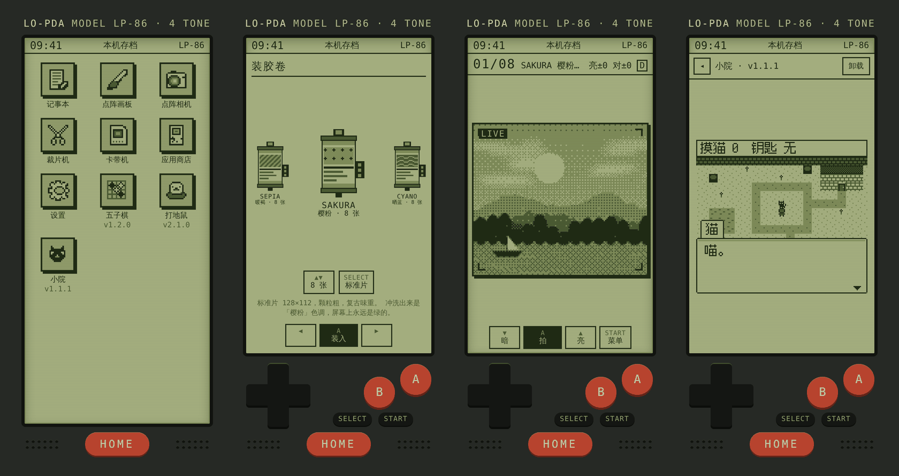
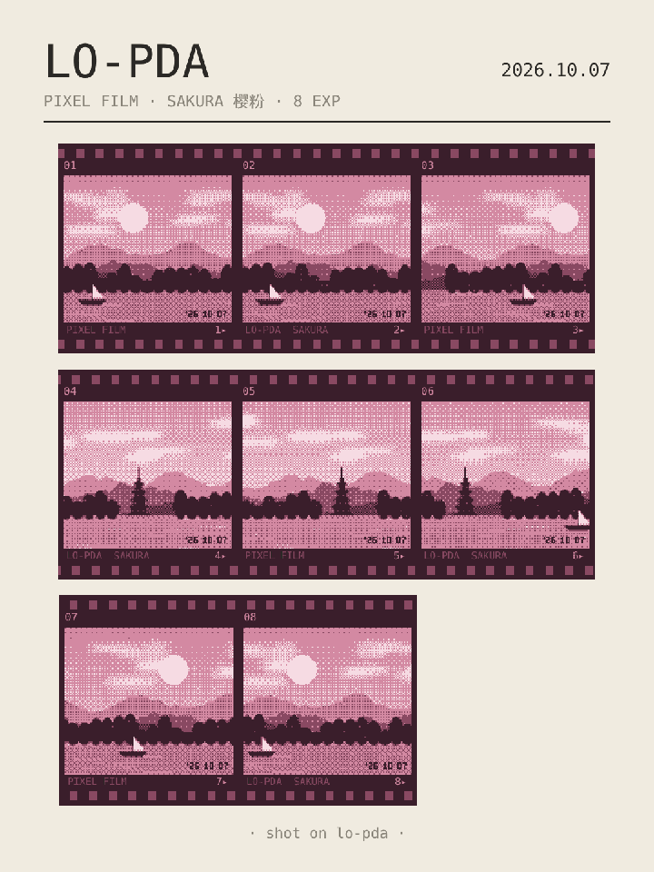
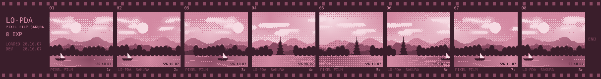

# Lo-PDA

A four-tone handheld that lives on your phone. Hi-PDA's low-fidelity cousin.

一台住在手机里的四色掌机，Hi-PDA 的低保真表亲。

**Try it:** https://nowheremanx.github.io/lopda/ — open it on a phone and "Add to Home Screen".



Lo-PDA is a Progressive Web App styled as a fictional 1986 PDA with a green LCD
and hardware buttons on its chin. It comes with a film camera, a strip cutter, a
pixel paint program, a Game Boy cartridge player and a store of small community
apps. Everything runs and is saved on the device; nothing needs an account.

## Shot on Lo-PDA

The camera behaves like a film camera. You load a roll of 8, 12 or 16 frames,
you can't see what you shot, and nothing comes out until the whole roll is
developed: as a film strip, or as a contact sheet sized for sharing.

 



<sub>Screenshots and film above were made in a desktop browser, with the camera fed a generated test scene.</sub>

## What's inside

| Built-in | 内置 | What it does |
|---|---|---|
| 记事本 | Notes | Plain notes, saved on the device. |
| 点阵画板 | Pixel paint | 96×96, four tones, import a photo as a dithered picture, export PNG. |
| 点阵相机 | Film camera | Live dithered viewfinder. Load a roll (8, 12 or 16 frames, standard or fine grain, one of five tints). No previews: develop the full roll into a film strip or a 3:4 contact sheet. Chin buttons after the Game Boy Camera. |
| 裁片机 | Strip cutter | Slide a developed strip under a fixed window and cut frames, halves or crossings, with optional paper edges. |
| 卡带机 | Cartridge player | Plays black-and-white Game Boy files you supply, with the chin buttons. No games are included. |
| 应用商店 | App store | Install, update and run community apps from `registry/`. |
| 设置 | Settings | Sound, volume, storage, and updating to the newest version. |

Community apps are single HTML files that run in a sandboxed iframe with no
network access, pinned by hash when installed. Games can use `sdk/lo-game.js`,
a small framework with a pixel font, dialogue boxes, menus and tile maps.
See `SPEC.md` and `sdk/LO-GAME.md`. Why things are the way they are:
[`docs/decisions.md`](docs/decisions.md).

## Run it locally

Any static file server at the repository root works, because the runtime loads
`../sdk/` and `../registry/`:

```sh
cd lopda
python3 -m http.server 8086
# open http://localhost:8086/runtime/
```

On a phone, open the runtime over **HTTPS** and use "Add to Home Screen".
Plain `http://<your-mac-ip>:8086` works for a quick look, but browsers disable
the live camera, offline mode and the share sheet on insecure origins. Two easy
ways to get HTTPS while developing:

```sh
# a temporary public https URL, no account needed
brew install cloudflared
cloudflared tunnel --url http://localhost:8086
# then open https://<random>.trycloudflare.com/runtime/ on the phone
```

or publish the repository with GitHub Pages.

## Write an app

```sh
cp -r sdk/template registry/apps/my-app       # then edit manifest.json: "id": "my-app"
# open http://localhost:8086/sdk/dev.html?app=registry/apps/my-app
node tools/check-app.mjs registry/apps/my-app
node tools/build-index.mjs
```

`sdk/PROMPT.md` is a ready-made prompt for writing an app with an AI assistant.
For games, use `sdk/lo-game.js` (see `sdk/LO-GAME.md`, which doubles as the AI
prompt) and start from `sdk/template-game/`, or `sdk/template-vn/` for a visual novel
(the story is a data block of lines, choices and flags).

## Layout

```
runtime/     the PWA (index.html, lopda.js, lopda.css, platform.js, sw.js, icons)
sdk/         MIT: PAD bridge, lo-game.js, templates, dev harness, AI prompts
registry/    index.json + apps/<id>/{manifest.json,index.html}
tools/       check-app.mjs, build-index.mjs, lo-game.mjs (Node 20+, no dependencies)
tests/       run with `node --test` (no dependencies)
SPEC.md      app specification lopda/1
```

## Design rule

Every change should take a decision away from the user, or at least not add
one. Fixed palette, fixed frame counts, frames you can't edit, one strip per
roll. The limits are the point.

## License

[MIT](LICENSE). Copyright (c) 2026 Haowei Wu.

Every registry app uses a permissive license of its author's choice. The name
"Lo-PDA" and its icons are not covered by the license: forks published for
others need their own name. Details in `LICENSING.md`.
